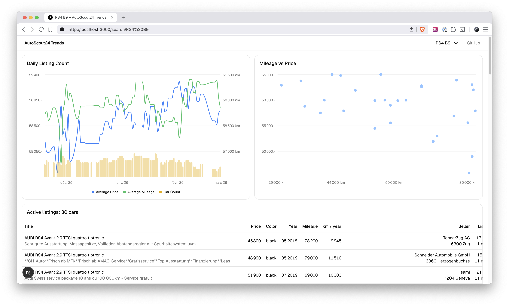

# AutoScout24 Trends

A car listing analytics platform that scrapes vehicle data from AutoScout24.ch, stores it in a PostgreSQL database, and provides a web 
interface to visualize trends and insights.

## Overview

This project consists of two main components:

1. **[Crawler](crawler/README.md)** — A Scrapy-based web scraper that extracts car listings from AutoScout24
2. **[Frontend](frontend/README.md)** — A Next.js web application that visualizes the collected data with charts and analytics

The system enables users to track car listings over time, analyze pricing trends, monitor availability, and compare historical data across different searches.

## Features

- **Automated Web Scraping**: Bypasses anti-bot protections using SeleniumBase CDP mode
- **Database Storage**: Persists car, seller, and search configuration data in PostgreSQL
- **Photo Archival**: Downloads and stores all seller-uploaded listing photos in Cloudflare R2 (WebP, deduplicated)
- **Screenshot Capture**: Takes full-page screenshots of car listings, compressed and stored in R2
- **Data Visualization**: Interactive charts and tables for analyzing trends
- **Image Lightbox**: Full-screen viewer for screenshots and listing photos with keyboard navigation
- **Search Management**: Configure and manage searches from the web UI
